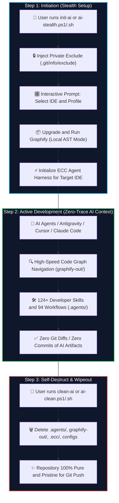

# 🛡️ Universal Stealth AI Harness (Graphify + ECC)

> **Zero-Trace, Zero-Cost AI Knowledge Graph & Agent Harness for ANY Codebase.**  
> Effortlessly harness Graphify AST and ECC (Everything Claude Code) on your personal PC, client repositories, or foreign machines without leaving a single trace in Git or repository history.

---

## 🌟 Key Highlights

- **🔒 Zero Git Footprint**: Modifies only local `.git/info/exclude` instead of `.gitignore`. `git add .`, `git status`, and `git diff` remain 100% untouched.
- **⚡ Zero LLM Cost (`--code-only`)**: Graphify analyzes abstract syntax trees (AST) locally without any paid API keys or external LLM tokens.
- **🎛️ Interactive Multi-IDE Support**: Dynamically installs tailored harnesses and skills for Google Antigravity, Claude Code, Cursor, Codex, OpenCode, Zed, and Kimi Code.
- **🌐 Universal Multi-OS Portability**: One-liner execution commands via PowerShell (Windows) and Bash (Linux/macOS).
- **💥 1-Click Self-Destruct**: Complete cleanup of all generated graphs, `.agents/` skill directories, agent caches, logs, and harnesses in seconds with zero residue.

---

## 🗺️ Architectural Workflow & Execution Flow



---

## 🚀 Quickstart Guide

### Option 1: One-Liner Execution (Any Machine - No Clone Required)

#### 🪟 Windows (PowerShell)

**1. Activate Stealth AI (Interactive IDE Selection)**
```powershell
irm https://raw.githubusercontent.com/devSubhamRoy/graphify-ecc/main/scripts/ai-stealth.ps1 | iex
```

**2. Cleanup / Self-Destruct when finished**
```powershell
irm https://raw.githubusercontent.com/devSubhamRoy/graphify-ecc/main/scripts/ai-clean.ps1 | iex
```

#### 🐧 Linux / 🍎 macOS (Bash / Zsh)

**1. Activate Stealth AI (Interactive IDE Selection)**
```bash
curl -fsSL https://raw.githubusercontent.com/devSubhamRoy/graphify-ecc/main/scripts/ai-stealth.sh | bash
```

**2. Cleanup / Self-Destruct when finished**
```bash
curl -fsSL https://raw.githubusercontent.com/devSubhamRoy/graphify-ecc/main/scripts/ai-clean.sh | bash
```

---

### Option 2: Local Setup (Clone & Run Offline)

If you prefer to keep the repository locally on your disk:

```bash
git clone https://github.com/devSubhamRoy/graphify-ecc.git
```

#### 🪟 Windows (PowerShell)

**From your project root:**
```powershell
powershell -ExecutionPolicy Bypass -File "C:\path\to\graphify-ecc\scripts\ai-stealth.ps1"
```

**Cleanup:**
```powershell
powershell -ExecutionPolicy Bypass -File "C:\path\to\graphify-ecc\scripts\ai-clean.ps1"
```

#### 🐧 Linux / 🍎 macOS (Bash)

**From your project root:**
```bash
bash /path/to/graphify-ecc/scripts/ai-stealth.sh
```

**Cleanup:**
```bash
bash /path/to/graphify-ecc/scripts/ai-clean.sh
```

---

### Option 3: Permanent Terminal Aliases (Personal Machine)

Add this to your PowerShell Profile (`notepad $PROFILE`):

```powershell
function init-ai {
    irm https://raw.githubusercontent.com/devSubhamRoy/graphify-ecc/main/scripts/ai-stealth.ps1 | iex
}

function clean-ai {
    irm https://raw.githubusercontent.com/devSubhamRoy/graphify-ecc/main/scripts/ai-clean.ps1 | iex
}
```

Now in **any project folder**, simply run:
- `init-ai` ➔ Select IDE/Profile & instantly setup stealth ignore + build knowledge graph & skills.
- `clean-ai` ➔ Wipes all AI footprints (`.agents/`, `graphify-out/`, etc.) before pushing to Git.

---

## 🎛️ Interactive Harness Selection

When the script runs, it prompts you to select your target IDE and profile:

```text
Select your IDE / AI Agent:
  [1] Google Antigravity (Default)
  [2] Claude Code
  [3] Cursor IDE
  [4] Codex
  [5] OpenCode
  [6] Gemini CLI
  [7] Zed
  [8] Kimi Code

Select ECC Profile to install:
  [1] Developer Profile (Recommended: TDD, Code Review, Testing, Git - 9 modules)
  [2] Full Profile (All 26 modules: DevOps, Docker, K8s, ML, 290+ skills)
  [3] Minimal Profile (Low-context core workflows)
```

| IDE / AI Tool | Adapter Target | Assets Configured |
| :--- | :---: | :--- |
| **Google Antigravity** | `antigravity` | Native `.agents/skills` (124+ skills), rules, workflows & subagents |
| **Claude Code** | `claude` | Marketplace plugin, prompts, rules & unified memory |
| **Cursor IDE** | `cursor` | `.cursor/agents`, rules & workflow definitions |
| **Codex** | `codex` | Native Codex plugin & role definitions |
| **OpenCode / Zed / Gemini / Kimi** | `opencode` / `zed` | Project-local adapters & workflow commands |

---

## 📂 Repository Structure

```text
graphify-ecc/
├── README.md                 # Project documentation & architecture
├── STEALTH_AI_GUIDE.md       # Comprehensive detailed handbook
├── WORKFLOW_FLOW.md          # Deep-dive execution lifecycle & diagrams
├── scripts/
│   ├── ai-stealth.ps1        # Windows setup & interactive stealth harness
│   ├── ai-clean.ps1          # Windows 1-click self-destruct script
│   ├── ai-stealth.sh         # Linux/macOS setup & interactive stealth harness
│   └── ai-clean.sh           # Linux/macOS 1-click self-destruct script
└── .gitignore                # Repository Git ignore
```

---

## 🛡️ Security & Privacy Deep Dive

### 1. Why `.git/info/exclude` over `.gitignore`?
Normal `.gitignore` edits create tracked diffs in Git. If you accidentally commit `.gitignore`, everyone on your team or client repo will see AI harness configurations.  
Using `.git/info/exclude` operates strictly at the local clone level: **Git will never track it, never stage it, and never push it to remote.**

### 2. Zero-Cost AST Parsing
Graphify is triggered with the `--code-only` flag. This uses tree-sitter AST parsing locally without transmitting your source code to 3rd party LLM API providers.

---

## 🤝 Contributing & License
Maintained by [@devSubhamRoy](https://github.com/devSubhamRoy).  
Licensed under the [MIT License](LICENSE).
