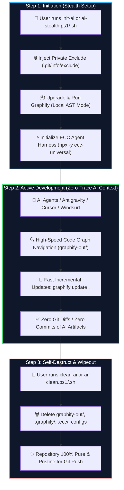

# 🛡️ Universal Stealth AI Harness (Graphify + ECC)

> **Zero-Trace, Zero-Cost AI Knowledge Graph & Agent Harness for ANY Codebase.**  
> Effortlessly harness Graphify AST and ECC (Everything Claude Code) on your personal PC, client repositories, or foreign machines without leaving a single trace in Git or repository history.

---

## 🌟 Key Highlights

- **🔒 Zero Git Footprint**: Modifies only local `.git/info/exclude` instead of `.gitignore`. `git add .`, `git status`, and `git diff` remain 100% untouched.
- **⚡ Zero LLM Cost (`--code-only`)**: Graphify analyzes abstract syntax trees (AST) locally without any paid API keys or external LLM tokens.
- **🌐 Universal Multi-OS Portability**: One-liner execution commands via PowerShell (Windows) and Bash (Linux/macOS).
- **💥 1-Click Self-Destruct**: Complete cleanup of all generated graphs, agent caches, logs, and harnesses in seconds with zero residue.

---

## 🗺️ Architectural Workflow & Execution Flow



---

## 🚀 Quickstart Guide

### Option 1: One-Liner Execution (Any Machine)

#### 🪟 Windows (PowerShell)
```powershell
# 1. Activate Stealth AI
irm https://raw.githubusercontent.com/devSubhamRoy/graphify-ecc/main/scripts/ai-stealth.ps1 | iex

# 2. Cleanup / Self-Destruct when finished
irm https://raw.githubusercontent.com/devSubhamRoy/graphify-ecc/main/scripts/ai-clean.ps1 | iex
```

#### 🐧 Linux / 🍎 macOS (Bash / Zsh)
```bash
# 1. Activate Stealth AI
curl -fsSL https://raw.githubusercontent.com/devSubhamRoy/graphify-ecc/main/scripts/ai-stealth.sh | bash

# 2. Cleanup / Self-Destruct when finished
curl -fsSL https://raw.githubusercontent.com/devSubhamRoy/graphify-ecc/main/scripts/ai-clean.sh | bash
```

---

### Option 2: Permanent Terminal Aliases (Personal Machine)

Add this to your PowerShell Profile (`notepad $PROFILE`):

```powershell
function init-ai {
    irm https://raw.githubusercontent.com/devSubhamRoy/graphify-ecc/main/scripts/ai-stealth.ps1 | iex
}

function clean-ai {
    irm https://raw.githubusercontent.com/devSubhamRoy/graphify-ecc/main/scripts/ai-clean.ps1 | iex
}
```

Now in **any project folder**, simply run:
- `init-ai` ➔ Instantly setups stealth ignore & builds knowledge graph.
- `clean-ai` ➔ Wipes all AI footprints before pushing to Git.

---

## 📂 Repository Structure

```
graphify-ecc/
├── README.md                 # Project documentation & architecture
├── STEALTH_AI_GUIDE.md       # Comprehensive Hindi/English detailed handbook
├── WORKFLOW_FLOW.md          # Deep-dive execution lifecycle & diagrams
├── scripts/
│   ├── ai-stealth.ps1        # Windows setup & stealth harness
│   ├── ai-clean.ps1          # Windows 1-click self-destruct script
│   ├── ai-stealth.sh         # Linux/macOS setup & stealth harness
│   └── ai-clean.sh           # Linux/macOS 1-click self-destruct script
└── .gitignore                # Repository Git ignore
```

---

## 🛡️ Security & Privacy Deep Dive

### 1. Why `.git/info/exclude` over `.gitignore`?
Normal `.gitignore` edits create tracked diffs in Git. If you accidentally commit `.gitignore`, everyone on your team or client repo will see AI harness configurations.  
Using `.git/info/exclude` operates strictly at the local clone level: **Git will never track it, never stage it, and never push it to remote.**

### 2. Zero-Cost AST Parsing
Graphify is triggered with the `--code-only` flag. This uses tree-sitter AST parsing locally without transmitting your source code to 3rd party LLM API providers.

---

## 🤝 Contributing & License
Maintained by [@devSubhamRoy](https://github.com/devSubhamRoy).  
Licensed under the [MIT License](LICENSE).
