# 🛡️ Universal Stealth AI Harness (Graphify + ECC) Guide

Yeh guide aapko kisi bhi system (apna PC, friend ka laptop, ya client ka production environment) par **Graphify** aur **ECC** ko zero-trace, stealth mode me run karne aur single command se complete wipe out karne ka complete system deti hai.

---

## 🔒 Security & Stealth Philosophy (Kyu safe hai?)

1. **Zero Git Trace**: System-level Git excludes (`.git/info/exclude`) use karta hai. Isse project ka original `.gitignore` modify nahi hota aur GitHub par `git add .` ya `git push` karne par bhi koi AI file ya graph kabhi push nahi hoga.
2. **Zero-Cost / Offline Ready (`--code-only`)**: Kisi bhi system par bina kisi LLM API key ke local AST se knowledge graph build karta hai.
3. **Auto-Updatable**: Hamesha latest packages pull karega taaki new features instantly available rahein.
4. **One-Click Self-Destruct**: Kaam khatam hote hi ek command se sabhi AI footprints wipe ho jayenge.

---

## 🔄 Lifecycle Workflow & Visual Flow

```mermaid
sequenceDiagram
    autonumber
    actor User as 👤 Developer
    participant Git as 📁 Local Git (.git/info/exclude)
    participant Graphify as 🧠 Graphify Engine
    participant ECC as ⚡ ECC Harness
    participant Remote as 🌐 GitHub Remote

    User->>Git: Run ai-stealth (Injects stealth ignore rules)
    Note over Git: .git/info/exclude modified (Invisible to git status)
    User->>Graphify: Local AST Parsing (--code-only)
    Graphify-->>User: Generates graphify-out/ knowledge graph
    User->>ECC: Initialize ECC Agent Rules & Harness
    ECC-->>User: Ready for AI Pair Programming
    
    rect rgb(20, 30, 40)
        Note over User,Graphify: Active Development Phase<br/>AI reads graph context<br/>Run 'graphify update .' for incremental sync
    end

    User->>User: Run ai-clean (Self-Destruct)
    Note over User: Deletes graphify-out, .ecc, configs
    User->>Remote: git push origin main
    Note over Remote: Clean repository pushed with ZERO AI traces!
```



---

## 📁 1. The Automation Scripts

### Script 1: `scripts/ai-stealth.ps1` (Windows Setup)
```powershell
# ==========================================
# Universal Stealth AI Setup (Graphify + ECC)
# ==========================================

Write-Host ""
Write-Host "[1/4] Enforcing Local Stealth Git-Ignore..." -ForegroundColor Cyan

# 1. Local Git private ignore (.git/info/exclude) update (Never committed to GitHub)
if (Test-Path ".git") {
    $excludePath = ".git/info/exclude"
    $ignoreEntries = @(
        "graphify-out/",
        ".graphify/",
        ".ecc/",
        "ecc.config.*",
        "*.agent-log",
        "ai-stealth.ps1",
        "ai-clean.ps1",
        "ai-stealth.sh",
        "ai-clean.sh",
        "STEALTH_AI_GUIDE.md"
    )
    
    if (-not (Test-Path ".git/info")) {
        New-Item -ItemType Directory -Path ".git/info" -Force | Out-Null
    }
    
    $existing = if (Test-Path $excludePath) { Get-Content $excludePath } else { @() }
    foreach ($entry in $ignoreEntries) {
        if ($existing -notcontains $entry) {
            Add-Content -Path $excludePath -Value $entry
        }
    }
    # Untrack if previously committed/staged
    git rm -r --cached graphify-out/ 2>$null | Out-Null
    Write-Host "   [OK] Local Git stealth ignore active (Zero trace in repo commits)" -ForegroundColor Green
} else {
    Write-Host "   [INFO] No .git folder found. Skipping git-exclude." -ForegroundColor Yellow
}

# 2. Update and Run Graphify (Zero-cost local AST mode)
Write-Host ""
Write-Host "[2/4] Updating & Running Graphify (Knowledge Graph)..." -ForegroundColor Cyan
try {
    pip install --upgrade graphifyy --quiet 2>$null
    graphify . --code-only
    Write-Host "   [OK] Graphify knowledge graph generated in graphify-out/" -ForegroundColor Green
} catch {
    Write-Host "   [WARN] Graphify run failed or Python/pip not present." -ForegroundColor Yellow
}

# 3. Setup ECC Agent Harness
Write-Host ""
Write-Host "[3/4] Initializing Latest ECC Harness..." -ForegroundColor Cyan
try {
    npx -y ecc-universal@latest setup --yes 2>$null
    Write-Host "   [OK] ECC Agent Harness configured successfully." -ForegroundColor Green
} catch {
    Write-Host "   [WARN] ECC setup encountered an error." -ForegroundColor Yellow
}

Write-Host ""
Write-Host "==================================================" -ForegroundColor Green
Write-Host "AI Stealth Mode Active! Ready for development." -ForegroundColor Green
Write-Host "To wipe all traces later, run: .\scripts\ai-clean.ps1" -ForegroundColor Gray
Write-Host "==================================================" -ForegroundColor Green
Write-Host ""
```

---

### Script 2: `scripts/ai-clean.ps1` (Windows Self-Destruct)
```powershell
# ==========================================
# AI Stealth Self-Destruct / Clean Script
# ==========================================

Write-Host ""
Write-Host "Wiping all AI footprints from current project..." -ForegroundColor Yellow

$targets = @(
    "graphify-out",
    ".graphify",
    ".ecc",
    "ecc.config.js",
    "ecc.config.json"
)

foreach ($target in $targets) {
    if (Test-Path $target) {
        Remove-Item -Recurse -Force -Path $target -ErrorAction SilentlyContinue
        Write-Host "   [DELETED] $target" -ForegroundColor Red
    }
}

# Clean temp logs if any
Get-ChildItem -Path . -Filter "*.agent-log" -Recurse -ErrorAction SilentlyContinue | Remove-Item -Force

Write-Host ""
Write-Host "Project is completely clean! Zero AI traces remaining." -ForegroundColor Green
Write-Host ""
```

---

## 🌐 2. Multi-System Portability (Kisi bhi Computer par chalane ke liye)

### Start Karte Waqt (Setup & Run):
PowerShell me direct yeh run karein:
```powershell
irm https://raw.githubusercontent.com/devSubhamRoy/graphify-ecc/main/scripts/ai-stealth.ps1 | iex
```

### Kaam Khatam Hone Par (Wipe & Clean):
```powershell
irm https://raw.githubusercontent.com/devSubhamRoy/graphify-ecc/main/scripts/ai-clean.ps1 | iex
```

---

## 💻 3. Apne Personal PC Par Permanent Shortcut

Apne PC par PowerShell me shortcut banane ke liye:
1. Terminal me run karein: `notepad $PROFILE`
2. Niche diye functions paste karke save kar lein:

```powershell
function init-ai {
    irm https://raw.githubusercontent.com/devSubhamRoy/graphify-ecc/main/scripts/ai-stealth.ps1 | iex
}

function clean-ai {
    irm https://raw.githubusercontent.com/devSubhamRoy/graphify-ecc/main/scripts/ai-clean.ps1 | iex
}
```

Ab aap apne PC ke kisi bhi project me sirf **`init-ai`** aur **`clean-ai`** type karke direct chala sakte hain!
