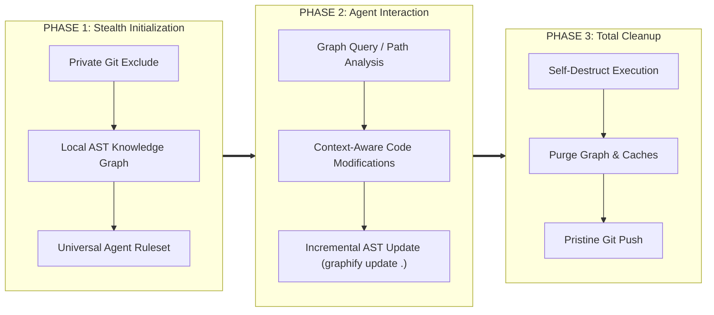

# 🧭 Detailed Execution Lifecycle & Flow Guide

This document breaks down the inner workings of **Graphify + ECC Stealth System** step by step.

---

## 🏗️ The 3-Stage Architecture Lifecycle

---

## 🔍 Deep Breakdown of Each Step

### 1. Private Git Exclusion (`.git/info/exclude`)
- Standard `.gitignore` is tracked by Git. Modifying it causes changes to show up in `git status` and pull requests.
- Local Git exclude file at `.git/info/exclude` operates strictly on the local machine copy.
- **Result:** AI generated folders like `graphify-out/`, `.graphify/`, `.ecc/`, and temporary scripts are 100% invisible to Git commands (`git status`, `git add .`, `git commit`).

### 2. Zero-Cost AST Knowledge Graph Generation
- Graphify extracts syntax trees directly from source code using tree-sitter.
- With `--code-only`, it maps out:
  - Functions & Call Graphs
  - Classes & Inheritances
  - Cross-file imports and module dependencies
  - God nodes & High-centrality architectural bottlenecks
- No external LLM calls are made during graph generation, guaranteeing zero API cost and instant execution.

### 3. Fast Incremental Updates
- When files are modified, running `graphify update .` performs AST diff analysis.
- Only changed files and dependent graph nodes are updated in milliseconds.

### 4. 1-Click Self-Destruct
- Purges all folders:
  - `graphify-out/`
  - `.graphify/`
  - `.ecc/`
  - `ecc.config.*`
  - `*.agent-log`
- The project is returned to its exact original state before AI tooling was introduced.
